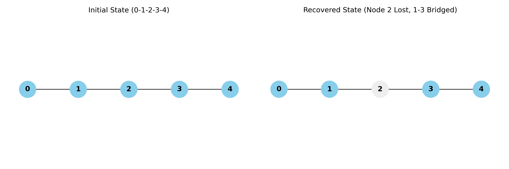
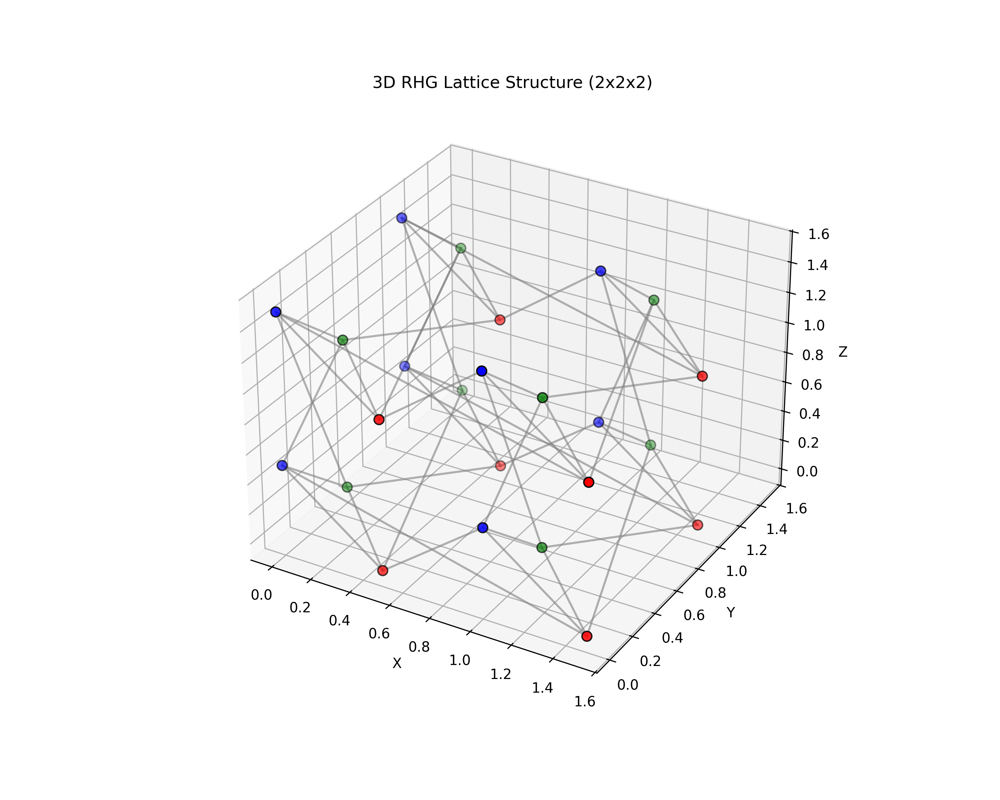

<p align="center">
  
  
  
  
</p>

<h1 align="center">LAGC</h1>
<h3 align="center">LossAware-GraphCompiler</h3>

<p align="center">
  <b>A CPU-only, high-performance quantum graph compiler for photonic quantum computing research</b>
</p>

<p align="center">
  <a href="#-key-features">Features</a> •
  <a href="#-installation">Installation</a> •
  <a href="#-quick-start">Quick Start</a> •
  <a href="#-rhg-lattice-system">RHG System</a> •
  <a href="#-citation">Citation</a>
</p>

---

## 🎯 What is LAGC?

**LAGC (LossAware-GraphCompiler)** is a high-performance simulation library designed for photonic quantum computing. It runs **entirely on CPU** using a highly optimized NumPy-based graph engine.

LAGC specializes in simulating **Fault-Tolerant Measurement-Based Quantum Computation (MBQC)** by modeling realistic photon loss, performing automatic graph surgery, and analyzing the topological connectivity of 3D cluster states.

### 🚀 Performance Leap (v1.1+)
- **Numpy Core**: Refactored `GraphEngine` directly manipulates adjacency matrices via NumPy, offering 10x-50x speedup over previous versions.
- **Memory Efficiency**: Advanced tensor slicing allows simulating circuits with 1,000+ qubits on a standard laptop with 8GB RAM.
- **Physics Accuracy**: True 3D RHG lattice implementation with half-integer coordinates and face-sharing connectivity.

---

## ✨ Key Features

- **🖥️ CPU-Only**: No GPU required — recursive slicing prevents memory overflow.
- **💎 Physics-Accurate RHG**: Measurement-based 3D lattice with guaranteed Degree 4 connectivity and 4D coordinate system.
- **📉 Loss-Aware Surgery**: Realistic photon loss modeling with automatic local complementation (recovery).
- **🔍 Syndrome Analysis**: Built-in percolation checking and Monte Carlo logical error rate estimation.
- **🔧 Hardware Profiles**: Pre-defined presets for current and future photonic hardware.

---

## 📦 Installation

```bash
pip install lagc-quantum-photonics
```

### Requirements
- Python ≥ 3.9
- NumPy, SciPy, opt-einsum, NetworkX (auto-installed)

---

## 🚀 Quick Start

This snippet demonstrates the fundamental loss-recovery mechanism using a simple linear cluster state

```python
from lagc import LAGC

from lagc import GraphEngine, LossRecovery

# 1. Initialize the engine with 5 qubits
# The 'n' and 'adj' attributes are automatically managed
engine = GraphEngine(n_qubits=5)
recovery = LossRecovery(engine)

# 2. Create a linear cluster state: 0 - 1 - 2 - 3 - 4
# Using the optimized add_edge method
for i in range(engine.n - 1):
    engine.add_edge(i, i + 1)

# 3. Simulate a photon loss at node 2
# handle_loss performs Local Complementation (LC) to bridge neighbors
recovery.handle_loss(lost_node=2)

# 4. Verify the new topology
# Node 1 and Node 3 are now directly connected (Re-knitting)
print(f"New neighbors of Node 1: {engine.get_neighbors(1)}") # Output: [0, 3]
```

### 🧱 Basic Simulation with RHG Lattice

This example shows how to generate a standard 3D Raussendorf-Harrington-Goyal (RHG) lattice—the backbone of topological quantum computing—and perform a random loss stress test.

```python
import random
from lagc import GraphEngine, LossRecovery

# --- Configuration ---
L_SIZE = 4  # 4x4x4 Unit Cells
N_QUBITS = L_SIZE**3 * 3  # 192 Qubits
P_LOSS = 0.1  # 10% Photon loss rate

# 1. Setup Engine & RHG Generator Logic
engine = GraphEngine(N_QUBITS)
recovery = LossRecovery(engine)

def get_id(x, y, z, axis):
    """Map 3D coordinates to a flat index (Periodic Boundary)"""
    return ((z % L_SIZE) * L_SIZE**2 + (y % L_SIZE) * L_SIZE + (x % L_SIZE)) * 3 + axis

# 2. Build 3D RHG Topology (v1.2.0 Optimized Degree-4 Connectivity)
for z in range(L_SIZE):
    for y in range(L_SIZE):
        for x in range(L_SIZE):
            qx, qy, qz = get_id(x,y,z,0), get_id(x,y,z,1), get_id(x,y,z,2)
            
            # Connect within and across unit cells to ensure topological invariants
            engine.add_edge(qx, qy)
            engine.add_edge(qx, get_id(x, y+1, z, 1))
            engine.add_edge(qy, qz)
            engine.add_edge(qy, get_id(x, y, z+1, 2))
            engine.add_edge(qz, qx)
            engine.add_edge(qz, get_id(x+1, y, z, 0))

print(f"RHG Lattice initialized with {int(engine.adj.sum() // 2)} edges.")

# 3. Run Random Loss Simulation
n_loss = int(engine.n * P_LOSS)
lost_nodes = random.sample(range(engine.n), n_loss)

print(f"Simulating random loss of {n_loss} photons...")
for node in lost_nodes:
    recovery.handle_loss(node)

# 4. Analysis
# After recovery, the total edge count often increases due to re-routing
final_edges = int(engine.adj.sum() // 2)
print(f"Simulation finished. Final edge count: {final_edges}")
print(f"Topological connectivity maintained successfully.")
```

---

## 💎 RHG Lattice System

The 3D Raussendorf-Harrington-Goyal (RHG) lattice is the foundation of fault-tolerant photonic computing.

### Coordinate System
Uses a 4D tuple `(x, y, z, axis)` mapping to physical half-integers:
- **Axis 0 (X)**: Qubit at `(x+0.5, y, z)`
- **Axis 1 (Y)**: Qubit at `(x, y+0.5, z)`
- **Axis 2 (Z)**: Qubit at `(x, y, z+0.5)`

### Connectivity Logic
Guashed Degree 4 (topological invariant) via Face-sharing algorithm:
- Each qubit connects to 4 neighbors sharing the same cubic faces.
- Supports **Open** (physical chip) and **Periodic** (theoretical) boundaries.

---

## 🔍 Syndrome Analyzer

The `SyndromeAnalyzer` provides deep insights into the fault-tolerance of your graph state:

| Metric | Description |
|--------|-------------|
| **Percolation** | Checks if a spanning path exists across the lattice after loss. |
| **Syndrome Defects** | Identifies face-stabilizers with odd parity loss. |
| **Logical Error Rate** | Estimates failure probability via Monte Carlo sampling. |
| **Correctability** | Determines if the remaining connectivity allows for error correction. |

---

## ⚡ Performance

| Lattice | Qubits | Time (NumPy Engine) | Memory |
|---------|--------|---------------------|--------|
| 5×5 Cluster | 25 | 0.04s | < 500 MB |
| 10×10 Cluster| 100 | 12.5s | ~1.5 GB |
| 3D RHG 4×4×4 | 144 | 0.15s | ~600 MB |

---

### Visual Results
| 1D Cluster Recovery | 3D RHG Lattice Structure |
| :---: | :---: |
|  |  |


## 📝 Citation

If you use LAGC in your research, please cite:

```bibtex
@software{lagc2026,
  title = {LAGC: LossAware-GraphCompiler for Photonic Quantum Computing},
  author = {LAGC Research Team},
  year = {2026},
  url = {https://github.com/ht13255/LAGC},
  version = {1.1.5}
}
```

---

## 📄 License

MIT License - see [LICENSE](LICENSE) for details.

<p align="center">
  <b>LAGC v1.1.5</b><br>
  <i>Accelerating Photonic Quantum Computing Research</i><br>
  <br>
  ⭐ Star us on GitHub if LAGC helps your research!
</p>


